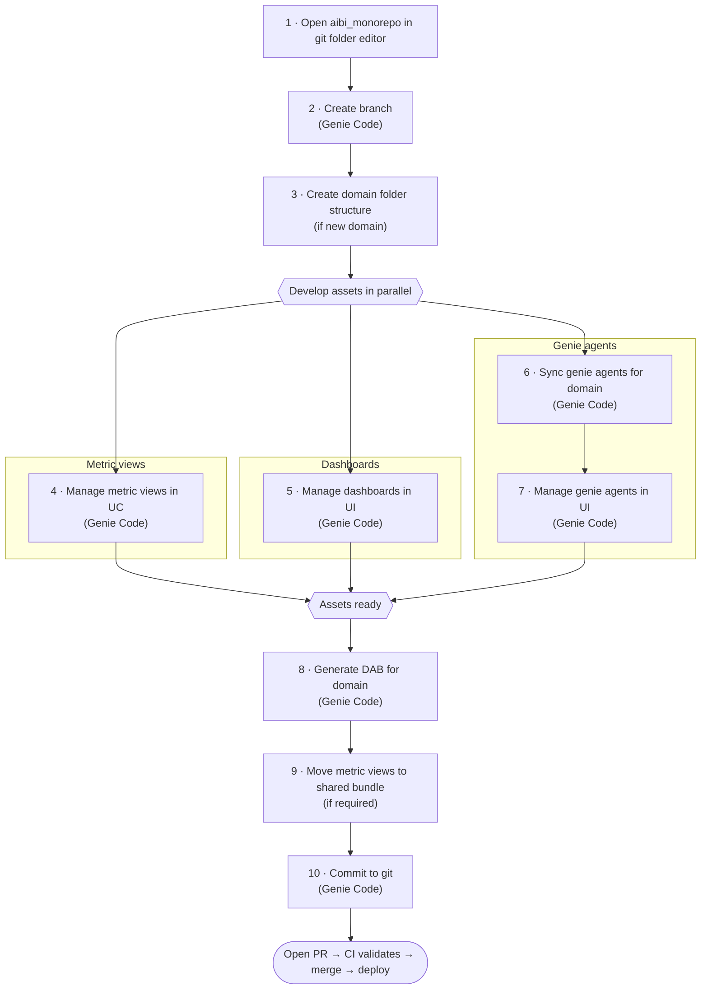

# User Guide

Develop and ship self-serve BI assets (Dashboards, Genie Agents, Metric Views).
One bundle per **domain** (`finance_operations/`, `supply_chain/`, …). Most work is done
by asking **Genie Code** in plain English.

## Getting started

1. Add and open `aibi_monorepo` in the git folder editor.
2. Ask Genie Code: `checkout master and create branch <user>/<branch>`
   — e.g. `checkout master and create branch aaronpan/update-sample-dashboard`
3. If the domain is new, create its folder structure: `<domain>/assets/dashboards`,`<domain>/assets/genie_agents`, `<domain>/assets/metric_views`, `<domain>/resources`
4. Manage metric views in UC, assisted by Genie Code — create, update, delete, rename.
5. Manage domain dashboards in Databricks UI, assisted by Genie Code — create, update, delete, rename.
6. Ask Genie Code: `sync genie agents for <domain>` — e.g. `sync genie agents for finance_operations`
7. Manage domain genie agents in Databricks UI, assisted by Genie Code — create, optimize, update, delete, rename.
8. Ask Genie Code: `generate DAB for <domain>` — e.g. `generate DAB for finance_operations`
9. Move domain specific metric views to shared bundle if required
10. Ask Genie Code: `commit to git`

Then open a pull request. CI validates it; merging to `master` deploys it.

### Workflow diagram

Metric view, dashboard, and genie agent development happen **in parallel**, then converge
before generating the DAB and committing.



## Folder structure

You work with your **domain folders** in this repo:

```text
<domain>/                              # your domain bundle, e.g. finance_operations/
├── assets/
│   ├── dashboards/*.lvdash.json           # ✍️  edit: dashboard definitions in UI
│   ├── genie_agents/
│   │   ├── *.geniespace.json              # ✍️  edit: native genie agent definitions in UI
│   │   └── *.genie_space.json             # 🤖 generated: deployable genie definitions
│   └── metric_views/*.metric_view.yml     # 🤖 generated
├── resources/
│   ├── dashboards.yml                     # 🤖 generated
│   ├── genie_agents.yml                   # 🤖 generated
│   └── metric_views.yml                   # 🤖 generated
└── databricks.yml                         # 🤖 generated: bundle entrypoint
```

✍️ = edit by hand · 🤖 = generated by `generate-dab`, do not edit

Metric views shared by more than one domain are maintained separately in the
`02_dataplatform_repo/` bundle, which is deployed by its own pipeline.
