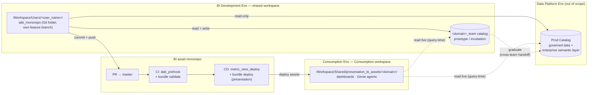
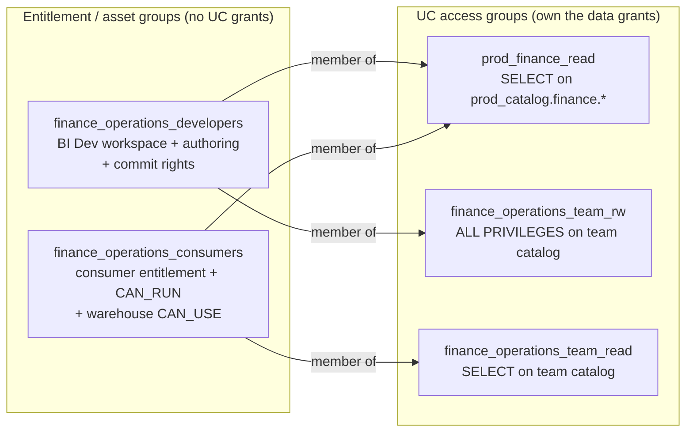

# Detailed Design — BI Development & Consumption Environments

This document drills into the two environments the
[high-level design](./high-level-design.md) only summarizes: the **BI Development
Env** (where BI assets are built) and the **Consumption Env** (where the business
consumes finished assets). It covers the access model, the internals of each
environment, and how assets are promoted between them.

It is written in **layered concreteness**: naming *conventions* (with `<domain>`,
`<user_name>`, `<env>` placeholders) are the rule, and the repo's
`finance_operations` bundle is used as the worked instance of those conventions.

The Data Platform Env is out of scope here except where BI Dev and Consumption
touch it (read-only Prod access, the incubation/graduation handoff).

### Topology & promotion flow



Solid arrows are deploy / write paths; dotted arrows are query-time reads and the
incubation → graduation handoff. Note CD deploys **assets only** — the dashboards
and Genie agents read Prod and Team catalogs live at query time; no data is copied.

---

## 1. Access model foundation

Access in both environments is driven by **groups**, never per-user grants. There
are **two distinct layers of group**, wired together by **group nesting**:

- **Entitlement / asset groups** — *what you can do in a workspace and with an
  asset.* Per-domain, per-role. These carry **no direct Unity Catalog grants.**
- **UC access groups** — *what data you can touch.* They hold the actual UC
  privileges (`USE CATALOG` / `USE SCHEMA` / `SELECT`, etc.) on specific catalogs
  and schemas. They are reusable and governed by the catalog / platform team.

An entitlement group gets data access by being **added as a member of** the UC
access group(s) it needs. This separation is universal — it applies to **both**
the BI Dev Env and the Consumption Env.

### Entitlement / asset groups (per domain, per role)

| Group (convention) | Worked example | Carries |
|---|---|---|
| `<domain>_developers` | `finance_operations_developers` | BI Dev workspace access; Git-folder / branch authoring; commit rights to the domain's bundle path in the monorepo. **No UC grants.** |
| `<domain>_consumers` | `finance_operations_consumers` | Consumption workspace **consumer entitlement**; `CAN_RUN` on that domain's published assets; `CAN_USE` on the backing warehouse. **No UC grants.** |

### Shared groups

| Group | Role |
|---|---|
| `bi-admins` | `CAN_MANAGE` on deployed domain bundles (declared in `databricks.yml`). |
| `platform-engineers` | Own CI/CD service principals and pipeline configuration. |
| `data-engineers` | RW in the Data Platform Dev env (defined by the data-platform design). |

### UC access groups (govern data)

Named for the data they grant, owned by the catalog / platform team, e.g.:

| UC access group (example) | Grants |
|---|---|
| `prod_finance_read` | Read-only on `prod_catalog.finance.*`. |
| `finance_operations_team_rw` | `ALL PRIVILEGES` on `finance_operations_team.*`. |
| `finance_operations_team_read` | Read-only on `finance_operations_team.*`. |

**Rule:** entitlement groups are *nested into* UC access groups. The difference
between a developer's read/write on the team catalog and a consumer's read-only is
entirely **which UC access groups their entitlement group is nested into** — not
different grants on the same group.

The diagram below shows the two layers for the `finance_operations` worked example
— entitlement/asset groups (what you can do) nested into UC access groups (what
data you can touch):



---

## 2. BI Development Environment

The self-service BI sandbox: a **single shared workspace** used by all domain BI
teams and the data platform team. Isolation does **not** come from workspace
folders — it comes from **per-user Git folders + per-user branches** (working
copies never overlap), the **team catalog** (write access), and **CI/CD branch /
path rules** (who can merge changes to which domain bundle).

### Workspace layout

Each developer clones the BI asset monorepo as a **Git folder** under their own
user space and works on their **own branch**:

```
/Workspace/
└── Users/<user_name>/
    └── aibi_monorepo/          ← Git folder: clone of the BI asset monorepo
        (checked out on the user's own feature branch, e.g. feat/<domain>-<change>)
```

There is no `/Workspace/Shared/bi_dev/...` authoring tree. The monorepo is the
shared surface; the workspace is just where each user's checkout lives.

### Team catalog

Each domain owns one team catalog. The domain-developer group reaches it through a
UC access group (`<domain>_team_rw`), which owns the catalog:

```
Catalog:  <domain>_team           (worked: finance_operations_team)
├── prototype/     ← fast, ungoverned iteration; metric views + derived tables
└── incubation/    ← promotion candidates being hardened for graduation

UC access:  finance_operations_team_rw = ALL PRIVILEGES on the catalog
            (finance_operations_developers is nested into this group)
```

### Two data sources a developer builds against

1. **Prod Catalog** — read-only, via a `prod_<domain>_read` UC access group;
   governed production data and the enterprise semantic layer.
2. **Their own team catalog** — read/write, via `<domain>_team_rw`; domain-specific
   metric views and prototype data products.

The entitlement group `<domain>_developers` holds neither grant directly; it is
nested into both UC access groups.

### Incubation → graduation path (ADR-0003)

1. A metric view or data product starts in `<domain>_team.prototype` — fast,
   ungoverned iteration.
2. It matures into `<domain>_team.incubation` as it is hardened for promotion.
3. It **graduates** by being transferred into the Data Platform repo / Prod
   Catalog — a cross-team handoff (the BI developer proposes; data engineering
   takes ownership in Prod).
4. After graduation the object lives in Prod Catalog and the team-catalog copy is
   **retired** to avoid drift.

Metric views shared by **more than one domain** do not live in a team catalog —
they belong in `02_dataplatform_repo` and are owned by the data platform team.

### Authoring workflow

1. Add the monorepo as a Git folder under `/Workspace/Users/<user_name>/`, check
   out a feature branch.
2. Author assets interactively (dashboards, Genie agents, metric views) against
   Prod Catalog (read) and the team catalog (read/write).
3. Commit and push the branch, open a PR against `master`.
4. CI validates the changed bundle(s); merge to `master` triggers CD promotion to
   Consumption (Section 4).

---

## 3. Consumption Environment

Where the business consumes finished BI assets. A **single Consumption workspace**
hosting published, production-grade dashboards and Genie agents. It has **no
authoring, no Git folders, and no team catalogs** — it only receives assets via CD.

### Published asset layout

CD deploys each domain bundle to a per-domain root path (matches the
`presentation` target in `databricks.yml`):

```
/Workspace/Shared/presentation_bi_assets/
├── finance_operations/     ← deployed by CD from the finance_operations bundle
├── supply_chain/
└── data_platform/

Bundle-level ACL:  bi-admins = CAN_MANAGE   (declared in databricks.yml)
```

### Data binding

Published assets read **directly from Prod Catalog + Team Catalogs** — no data
copy into a consumption catalog, and no requirement that team-catalog metric views
graduate to Prod first. A `finance_operations` dashboard may reference both
`prod_catalog.*` and `finance_operations_team.*` objects.

### Access & credentials

Assets run under the **querying user's identity**, so a consumer needs both the
asset capability and UC read on the referenced data. Both are supplied by groups,
in the two-layer model from Section 1:

| What | How access is granted |
|---|---|
| Published dashboard / Genie asset | `<domain>_consumers` gets `CAN_RUN` on that domain's assets — scoped to the one domain the group covers. |
| Backing SQL warehouse | `<domain>_consumers` gets `CAN_USE` on the warehouse (`${var.warehouse_id}`). |
| Underlying Prod + Team Catalog data | `<domain>_consumers` is **nested into** the UC access group(s) whose data its assets reference — it holds **no UC grants directly**. |

```
finance_operations_consumers        (consumer entitlement + CAN_RUN, no UC grants)
   └── member of → prod_finance_read              (SELECT on prod_catalog.finance.*)
   └── member of → finance_operations_team_read   (SELECT on finance_operations_team.*)
```

A user without the domain-consumer group sees neither the asset nor the data
(ADR-0005: consumers strictly read). A user in two domain-consumer groups can run
both domains' assets; their data access never widens beyond the union of the UC
access groups those consumer groups are nested into.

---

## 4. Promotion mechanics (BI Dev → Consumption)

### Single bundle target

Each domain `databricks.yml` uses one `presentation` target — CD-only, deploying
to the Consumption workspace:

```yaml
targets:
  presentation:                 # Consumption workspace — CD only
    default: true
    mode: production
    workspace:
      host: https://<consumption-workspace>.cloud.databricks.com
      root_path: /Workspace/Shared/presentation_bi_assets/${bundle.name}
    permissions:
      - level: CAN_MANAGE
        group_name: bi-admins
```

There is no `dev` bundle target. Developer self-test happens **interactively in
the BI Dev workspace** (the Git-folder + own-branch model in Section 2), authoring
against Prod (read) and the team catalog (read/write) — not via `bundle deploy`.
The bundle is validated in CI, never deployed to a dev target.

### Flow

Grounds the existing `01_aibi_monorepo/.github/workflows/cd.yml` and
`detect-changed-dabs.sh`:

```
feature branch (Git folder)          PR → master                 CD (on push to master)
──────────────────────────          ───────────                 ──────────────────────
author + self-test              →    CI: dab_prehook,       →    detect changed DAB folders
interactively in BI Dev              bundle validate             per changed domain (matrix):
(Prod read + team catalog RW)        (per changed bundle)          dab_prehook
                                                                   bundle validate
                                                                   metric_view_deploy
                                                                   bundle deploy (presentation)
                                                                   → Consumption workspace
```

### What CD deploys vs. does not

- **Deploys:** the dashboard / Genie / metric-view *assets* to the Consumption
  workspace (`presentation` target), plus domain metric views via
  `metric_view_deploy`.
- **Does NOT deploy or grant:** data, or consumer UC access. Assets read live from
  Prod + Team catalogs (Section 3); consumer data access is governed separately via
  UC-access-group nesting, **not** by the asset pipeline. This keeps CD's blast
  radius to assets only (ADR-0006).

### Grants ownership boundary

| Owner | Owns |
|---|---|
| CI/CD (platform engineers) | *Asset* permissions — `CAN_MANAGE: bi-admins` and `<domain>_consumers` `CAN_RUN`, both declared on the `presentation` target so they are versioned and pipeline-applied. |
| Catalog / platform team | *UC access groups* and their membership (who is nested into `prod_finance_read`, `finance_operations_team_read`, etc.) — managed outside the asset pipeline. |

### Shared metric views ordering

`02_dataplatform_repo` is its own repo with the same CI/CD pattern. Its CD deploys
shared (cross-domain) metric views to Prod **ahead of** the domain bundles in
`01_aibi_monorepo` that depend on them.

---

## Related

- [High-level design](./high-level-design.md)
- ADRs: [0002](./ADRs/0002-shared-workspace-per-team-catalogs.md),
  [0003](./ADRs/0003-team-catalog-as-incubator.md),
  [0004](./ADRs/0004-read-only-production-for-bi.md),
  [0005](./ADRs/0005-consumers-strictly-read.md),
  [0006](./ADRs/0006-cicd-only-path-to-production.md)
