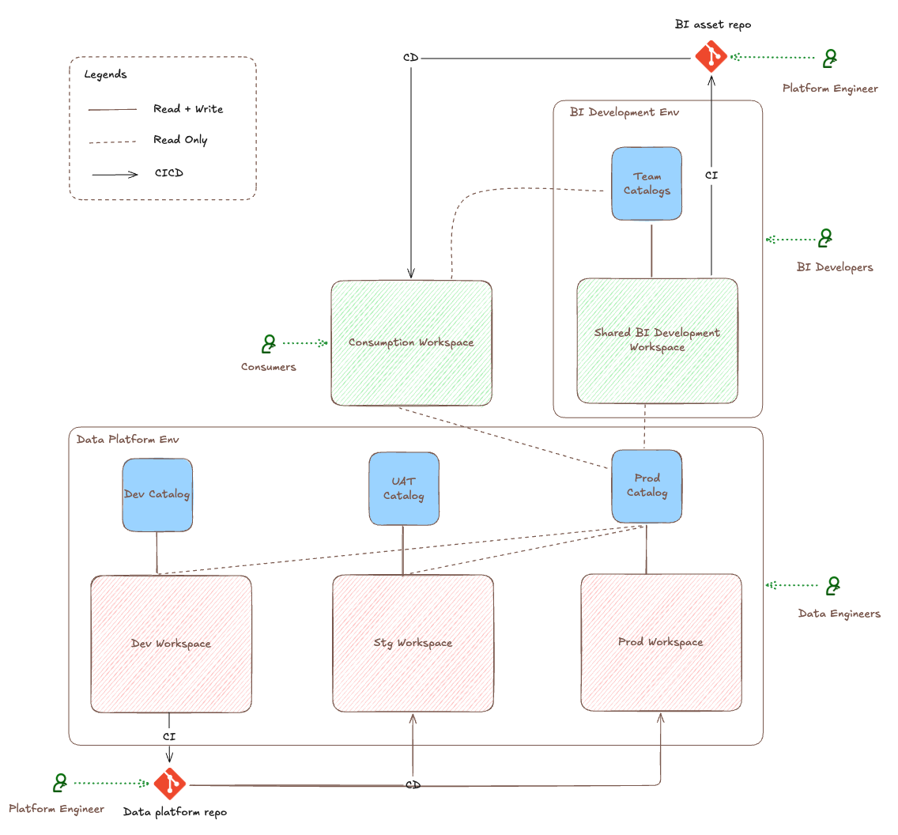

# Databricks Enterprise Self-Service BI Environment Architecture

This design describes the workspace / Unity Catalog / Git-repo layout that enables
**self-service BI** for enterprise: domain teams and citizen developers can build and ship BI
assets (dashboards, Genie agents, metric views) without waiting on the central data platform
team, while a hardened CI/CD path still governs what reaches production.

The design separates concerns along three axes:

- **Environments** — three isolated blast radii (Data Platform, BI Development, Consumption).
- **Personas** — four access patterns (Data Engineer, BI Developer, Consumer, Platform Engineer), each with the least privilege it needs.
- **Git repositories** — two independent repos (Data platform repo, BI asset monorepo), each the source of truth for its own CI/CD promotion flow.

---

## Environments

### Data Platform Env

The governed core, owned by the enterprise data platform team. It holds
the medallion architecture, enterprise data products, and the semantic layer
(metric views materialized views, views, tables). It is split into three
promotion stages, each a workspace paired with its own catalog:

| Workspace | Catalog | Purpose |
|---|---|---|
| **Dev Workspace** | **Dev Catalog** | Where data engineers author and iterate on pipelines and data products. |
| **Stg Workspace** | **UAT Catalog** | Staging / user-acceptance testing before production. |
| **Prod Workspace** | **Prod Catalog** | Production data products and the enterprise semantic layer. |

Promotion is **CI/CD only** — code lands in the **Data platform repo**, and the
pipeline promotes it Dev → Stg → Prod. Engineers do not hand-edit Stg or Prod.

### BI Development Env

The self-service BI sandbox, shared by domain BI teams and enterprise data platform team.
It contains:

- **BI Development Workspace** — a **single shared workspace** where all BI assets
  (dashboards, Genie agents) are built. It is shared across all business domains and
  teams, including enterprise data platform team
- **Team Catalogs** — the workspace is shared, but each team stays isolated:
  **every team owns its own team catalog** in Unity Catalog, so a team's semantic models 
  (metric views),  and grants live under its catalog and never mix with another team's.
- **Prod Catalog** - A team creates domain specific or enterprise-wide
  data products and semantic models based on production data managed and
  governed by enterprise data platform team. The objects are created in its team
  catalog **first**, iterates quickly, and later **transfers them to the Data
  Platform catalog** once they're enterprise-ready and/or production-worthy. This is
  the key incubation path: prototype in the team catalog,
  graduate to the enterprise data platform.

BI assets are versioned in the separate **BI asset repo** (distinct from the data
platform repo), keeping the BI release cadence independent from the data
platform's.

### Consumption Env

Where the business consumes finished BI assets.

- **Consumption Workspace** — hosts published, production-grade dashboards and 
  Genie agents for end users. It receives BI assets promoted from the BI dev environment via CI/CD
  and reads data from **Prod Catalog** and **Team Catalogs**.
---

## Git repositories

Source control is a first-class concern: **each environment is fed by its own Git
repo**, and CI/CD — not manual edits — is the only path from a repo to a deployed
environment. The two repos are deliberately independent so their release cadences
never couple.

| Repo | Owns | Feeds | Cadence |
|---|---|---|---|
| **Data platform repo** | Pipelines, medallion tables, enterprise data products, and the enterprise semantic layer. | Data Platform Env — promoted Dev → Stg → Prod. | Slower, higher blast radius; governed by the data platform / data engineering team. |
| **BI asset monorepo** | BI assets (dashboards, Genie agents, metric views), organised as one bundle per domain | BI Development Env → Consumption Env via CI/CD. | Fast, domain-driven; domain bundle owned by individual teams |

- **Two repos, two cadences.** Splitting the repos lets BI teams ship on their own
  schedule without waiting on the data platform release cycle.
- **Repo boundary ≠ team boundary.** The BI asset repo is shared across domains —
  each domain is a self-contained bundle (owned, developed, and deployed
  independently), and metric views shared by more than one domain live in data platform
  repo maintained by the enterprise data platform team.
- **CI/CD is the only writer of Stg/Prod/Consumption.** Both repos drive
  pipeline-only promotion; enforce standards and policies through automation and review.
  no persona hand-edits a promoted environment.

---

## Personas & access patterns

### Data Engineer

- **Read + Write** on the **Dev Workspace / Dev Catalog** — their build surface
  for pipelines, medallion tables, enterprise data products, and the semantic
  layer (metric views, materialized views, views, tables).
- Changes flow to Stg and Prod through the **Data platform repo** CI/CD pipeline,
  never by direct edit.

### BI Developer

Two flavors, same entitlement shape:

- **Business citizen developer** — builds BI assets for a specific domain.
- **Data-team BI developer** — builds enterprise-wide BI assets.

They have **Read + Write** in the shared **BI Development Workspace** and in
**their own team catalog**, **read-only** access to the **Prod Catalog** (so
dashboards/Genie can be built against governed production data), and they commit
BI assets to the **BI asset repo**. The workspace is shared across teams, but a
developer's write access is scoped to their own team catalog, so teams stay
isolated. Data products they incubate in the team catalog can be transferred into
the Data Platform catalog later.

### Consumer

- Holds a **consumer entitlement only** — access to the **Consumption Workspace**
  to view dashboards and query Genie agents.
- No write access anywhere; no access to development or platform environments.

### Platform Engineer

- Owns the **CI/CD pipelines** that promote assets across environments.
- Drives the **Data platform repo** → Dev/Stg/Prod promotion flow **and** the
  **BI asset repo** → Consumption promotion flow.
- Read/write to the repos and pipeline configuration; the promotion arrows in the
  diagram are their responsibility.

---

## Access matrix

| Resource | Data Engineer | BI Developer | Consumer | Platform Engineer |
|---|---|---|---|---|
| Dev Workspace / Dev Catalog | Read + Write | — | — | CI/CD |
| Stg Workspace / UAT Catalog | via CI/CD | — | — | CI/CD |
| Prod Workspace / Prod Catalog | via CI/CD | Read-only | — | CI/CD |
| BI Development Workspace (shared) / own Team Catalog | — | Read + Write | — | — |
| Consumption Workspace | — | — | Read (consume) | CI/CD |
| Data platform repo | Read + Write | — | — | Read + Write |
| BI asset repo | — | Read + Write | — | Read + Write |

---

## Design decisions

The rationale behind this design is captured as **Architecture Decision Records**
in [`ADRs/`](ADRs/README.md) — one numbered ADR per decision, each listing the
options considered and why the decision was made.

| ADR | Decision |
|---|---|
| [0001](ADRs/0001-two-repos-two-cadences.md) | Two repos, two cadences |
| [0002](ADRs/0002-shared-workspace-per-team-catalogs.md) | One shared workspace, per-team catalogs |
| [0003](ADRs/0003-team-catalog-as-incubator.md) | Team catalog as an incubator |
| [0004](ADRs/0004-read-only-production-for-bi.md) | Read-only production data for BI |
| [0005](ADRs/0005-consumers-strictly-read.md) | Consumers are strictly read-only |
| [0006](ADRs/0006-cicd-only-path-to-production.md) | CI/CD is the only path to production |
